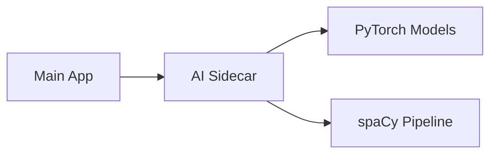

# AI Service Documentation

> Sidecar microservice for sentiment analysis and prediction models.

---

## Overview

The AI service operates as a **sidecar microservice** within the QuoteVote architecture, located at `/services/ai`. It provides machine learning capabilities including:

- **Sentiment Analysis** — Classifies text content for emotional tone
- **Prediction Models** — ML-based predictions for user engagement metrics

This service is designed to be deployed alongside the main application, communicating via internal APIs.

---

## Architecture

| Component    | Purpose                            |
| ------------ | ---------------------------------- |
| **Flask**    | Lightweight REST API framework     |
| **Graphene** | GraphQL integration layer          |
| **PyTorch**  | Deep learning model inference      |
| **spaCy**    | NLP preprocessing and tokenization |
| **Docker**   | Containerized deployment           |



---

## Setup

### Build the Container

```bash
docker build -t quotevote-ai ./services/ai
```

### Run the Container

```bash
docker run -d \
  --name quotevote-ai \
  -p 5001:5001 \
  quotevote-ai
```

---

## Configuration

> [!NOTE]
> The following environment variables are planned for future releases.

| Variable                | Description                           | Status     |
| ----------------------- | ------------------------------------- | ---------- |
| `AI_MODEL_PATH`         | Path to trained PyTorch model weights | 🚧 Roadmap |
| `AI_CLASSIFIER_PATH`    | Path to sentiment classifier model    | 🚧 Roadmap |
| `AI_TRAINING_DATA_PATH` | Path to training dataset directory    | 🚧 Roadmap |

---

## Roadmap

- [ ] Expose configurable model paths via environment variables
- [ ] Add health check endpoint
- [ ] Implement model versioning and hot-reload
